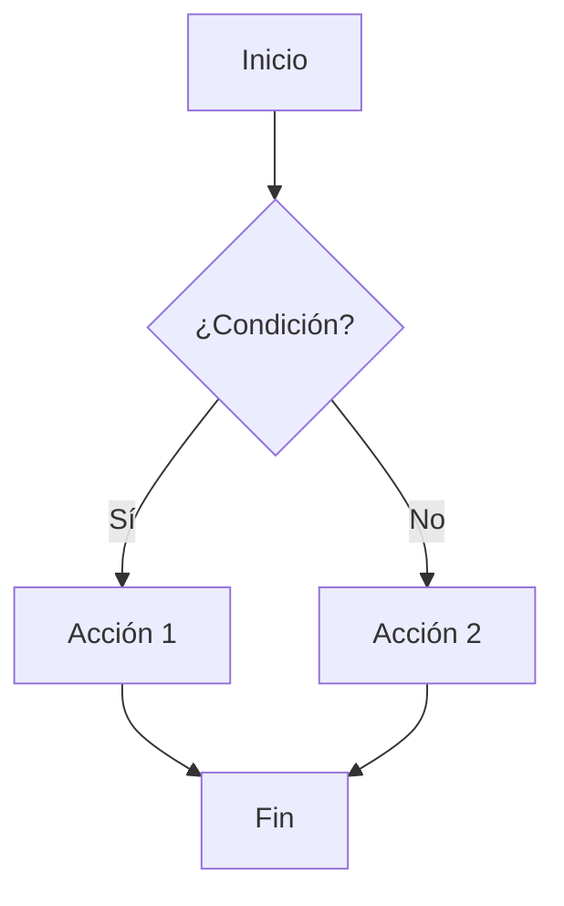
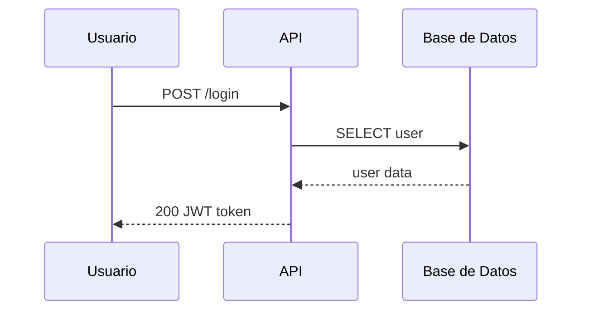

# Obsidian Markdown — Cheatsheet Completo

%% Esta nota es una referencia viva. Editala y agregá lo que descubras %%

---

## Headings
# H1 — Título principal
## H2 — Sección
### H3 — Subsección
---
## Formato de texto

| Sintaxis                | Resultado             |
| ----------------------- | --------------------- |
| `**negrita**`           | **negrita**           |
| `*itálica*`             | *itálica*             |
| `***negrita itálica***` | ***negrita itálica*** |
| `~~tachado~~`           | ~~tachado~~           |
| `==resaltado==`         | ==resaltado==         |
| `` `código inline` ``   | `código inline`       |
| `H~2~O`                 | H~2~O (subíndice)     |
| `X^2^`                  | X^2^ (superíndice)    |

---
  
## Links internos (Wikilinks)

  

```markdown

[[nota]] → link a nota

[[nota#Sección]] → link a heading específico

[[nota#^bloque-id]] → link a bloque específico

[[nota|texto visible]] → alias (texto personalizado)

![[nota]] → embeber nota completa

![[nota#Sección]] → embeber solo una sección

```

  

### Links externos

  

```markdown

[Google](https://google.com)

[Google](https://google.com "tooltip al hover")

```

  

---

  

## Listas


### Desordenadas

- Item 1

- Item 2

- Sub-item

- Otro sub-item

- Más profundo

  

### Ordenadas

1. Primero

2. Segundo

3. Sub-paso

4. Otro sub-paso

5. Tercero

  

### Checkboxes (tareas)

- [ ] Pendiente
- [x] Completada
- [/] En progreso
- [-] Cancelada
- [?] Pregunta
- [!] Importante
- [>] Diferida
- [<] Agendada
  
---

  

## Tablas
  

> [!tip] Advanced Tables
> Con el plugin, presioná `Tab` para navegar celdas y auto-formatear.
> **No olvides la línea `|---|---|`** entre header y datos.

| #   | name   |
| --- | ------ |
| 1   | oscar  |
| 2   | javier |
| 3   | campos |


  

---

  

## Bloques de código

  

### Inline

Usá `const x = 42` dentro del texto.


### Bloque con lenguaje

```javascript

const client = "VOLCAN";
const greeting = `Hola, ${client}`;
console.log(greeting);

```

  

```python

def fibonacci(n: int) -> list[int]:
	a, b = 0, 1
	result = []
	for _ in range(n):
	result.append(a)
	a, b = b, a + b
	return result

```

  

```bash

#!/bin/bash

obsidian tasks todo format=json | jq '.[] | .text'

```

  

```sql

SELECT client, SUM(cost) as total
FROM invoices
WHERE date >= '2026-01-01'
GROUP BY client
ORDER BY total DESC;

```

  

```hcl

resource "aws_s3_bucket" "data" {

bucket = "my-data-bucket"

tags = {

Environment = "production"

}

}

```

  

```yaml

services:
api:
image: node:20-alpine
ports:
- "3000:3000"
environment:
- NODE_ENV=production

```

  

---

  

## Callouts (admoniciones)
  
> [!note] Nota
> Información general. Color azul.

> [!tip] Consejo
> Algo útil para recordar.


> [!info] Información
> Contexto adicional.

  

> [!warning] Advertencia
> Precaución con esto.

  

> [!danger] Peligro
> Acción destructiva o irreversible.

> [!question] Pregunta
> ¿Algo por investigar?

> [!success] Éxito
> Verificado y funcionando.  

> [!failure] Fallo
> No funcionó como se esperaba.

> [!bug] Bug
> Error encontrado — requiere fix.

> [!example] Ejemplo
> Caso concreto de uso.

> [!quote] Cita
> "La simplicidad es la máxima sofisticación." — Leonardo da Vinci


> [!info]- Callout colapsable (cerrado por defecto)
> Agregá `-` después del tipo para que inicie colapsado.
> Hacé click en el título para expandir.

  

> [!tip]+ Callout colapsable (abierto por defecto)

> Agregá `+` para que inicie expandido pero sea colapsable.

  

### Callouts anidados

  

> [!question] ¿Cómo funciona?

> Podés anidar callouts dentro de otros:

>> [!success] Respuesta

>> Así, con doble `>`.

  

---

  

## Frontmatter (propiedades YAML)

  

```yaml

title: Nombre de la nota
tags: [tag1, tag2, tag3]
aliases: [nombre-alternativo, otro-alias]
status: draft | in-progress | complete
date: 2026-03-27
cssclasses: [wide-page, custom-style]
publish: true

```

  

> [!info] Uso

> Las propiedades aparecen al inicio del archivo.

> Obsidian las usa para búsqueda, filtros, y Dataview.

  

---

  

## Tags

  

```markdown

#simple

#proyecto/activo → tag anidado

#proyecto/activo/fase-1 → más niveles

```

  

#referencia #obsidian #markdown

  

---

  

## Footnotes (notas al pie)

  

Einstein revolucionó la física[^1] con una ecuación elegante[^relatividad].

  

Obsidian renderiza las notas al pie al final de la nota[^inline].

  

[^1]: Albert Einstein, 1879–1955.

[^relatividad]: $E = mc^2$, publicada en 1905.

[^inline]: Las footnotes se numeran automáticamente sin importar el nombre que les pongas.

  

---

  

## Math (LaTeX)

  

### Inline

La energía es $E = mc^2$ y la gravedad $F = G\frac{m_1 m_2}{r^2}$.

  

### Bloque — Ecuación de campo de Einstein (Relatividad General)

  

$$

R_{\mu\nu} - \frac{1}{2} R \, g_{\mu\nu} + \Lambda \, g_{\mu\nu} = \frac{8\pi G}{c^4} \, T_{\mu\nu}

$$

  

### Bloque — Ecuación de Schrödinger

  

$$

i\hbar \frac{\partial}{\partial t} \Psi(\mathbf{r}, t) = \hat{H} \Psi(\mathbf{r}, t)

$$

  

### Bloque — Ecuaciones de Maxwell

  

$$

\begin{aligned}

\nabla \cdot \mathbf{E} &= \frac{\rho}{\varepsilon_0} \\

\nabla \cdot \mathbf{B} &= 0 \\

\nabla \times \mathbf{E} &= -\frac{\partial \mathbf{B}}{\partial t} \\

\nabla \times \mathbf{B} &= \mu_0 \mathbf{J} + \mu_0 \varepsilon_0 \frac{\partial \mathbf{E}}{\partial t}

\end{aligned}

$$

  

### Bloque — Sumatoria e integral

  

$$

\sum_{i=1}^{n} x_i = x_1 + x_2 + \cdots + x_n

$$

  

$$

\int_{a}^{b} f(x) \, dx = F(b) - F(a)

$$

  

---

  

## Mermaid (diagramas)

  

### Flowchart

  



  

### Sequence diagram

  



  


  

## Blockquotes

  

> Cita simple de un párrafo.

  

> Cita con múltiples líneas.

> Continúa en la siguiente línea.

>

> Y con un párrafo separado.

  

> Cita anidada nivel 1

>> Nivel 2

>>> Nivel 3

  

---

  

  

## Atajos de teclado útiles

  

| Atajo | Acción |
| :---- | :----- |
| `Cmd + E` | Alternar edición / lectura |
| `Cmd + B` | Negrita |
| `Cmd + I` | Itálica |
| `Cmd + K` | Insertar link |
| `Cmd + P` | Command palette |
| `Cmd + O` | Quick switcher (buscar nota) |
| `Cmd + Shift + F` | Buscar en todo el vault |
| `Cmd + N` | Nueva nota |
| `Cmd + ,` | Configuración |
| `Cmd + L` | Toggle checkbox |
| `Tab / Shift+Tab` | Indentar / Des-indentar |
| `Cmd + ]` | Indentar |
| `Cmd + [` | Des-indentar |
| `Cmd + Enter` | Toggle checkbox |

  

---

  

> [!quote] Recordá

> La mejor nota es la que podés encontrar cuando la necesitás.

> Usá **links**, **tags** y **propiedades** para conectar todo.